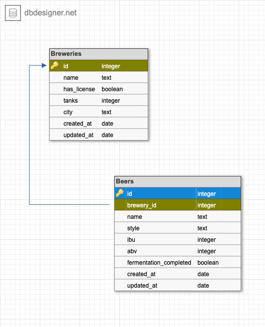

# Relational Rails: Breweries + Beers

[Relational Rails](https://backend.turing.edu/module2/projects/relational_rails/index) is a solo project in the Turing School of Software and Design Back End Engineering Mod 2 curriculum. The project includes designing a one-to-many relationship using a schema designer, writing migrations, using Rails to create a web application that allows users to CRUD resources, and writing model and feature tests with RSpec and Capybara.

For this project, I chose to work with the parent-child relationship "Breweries + Beers".

## Database Design

Relational Rails: Breweries + Beers currently has two database tables: Breweries and Beers, in a one-to-many relationship. Breweries can have many Beers.

Breweries have attributes for name, number of tanks, city, and whether or not they have a license. Beers have attributes for name, style, IBU, ABV, and whether or not fermentation is completed. Beers are related to parent Breweries through the foreign key `brewery_id`.



The database design diagram can also be viewed on DBDesigner [here](https://dbdesigner.page.link/Bm7WVQemJ5MXyKRd8).

## User Stories

This project was developed by following the user stories specified in the assignment. More details on these stories can be found [here](https://backend.turing.edu/module2/projects/relational_rails/index).

## Setup + Usage

To run Relational Rails: Breweries + Beers locally, please complete the following steps.

1. Clone the project repository and navigate to the main project directory in your terminal.

```
git clone git@github.com:cariperi/relational_rails.git
cd relational_rails
```

2. Run this command in your terminal to install project gems:

```
bundle install
```

3. Ensure that Postgres is running, and run thee commands to initialize the development database, set up the database structure, and seed the development database with sample data:

```
rails db:create
rails db:migrate
rails db:seed
```

4. Run this command to start the Rails server:

```
rails s
```

5. Navigate to [localhost:3000](http://localhost:3000/) in your browser and explore!

## Testing

To run model tests for this app, type the following command in your terminal from inside the cloned project folder:

```
bundle exec rspec spec/models
```

To run feature tests for this app, type the following command in your terminal from inside the cloned project folder:

```
bundle exec rspec spec/features
```

## Project Status

As of March 28, 2023 the Relational Rails: Breweries + Beers project has functionality to complete Iterations 1-3 of the assignment, including User Stories 1-23. This app also includes search functionality on the Breweries and Beers index pages as specified by the Extension user stories.

In the future, I plan to explore the other Extension story and add functionality to sort Breweries by the number of Beers that they have in the database.
